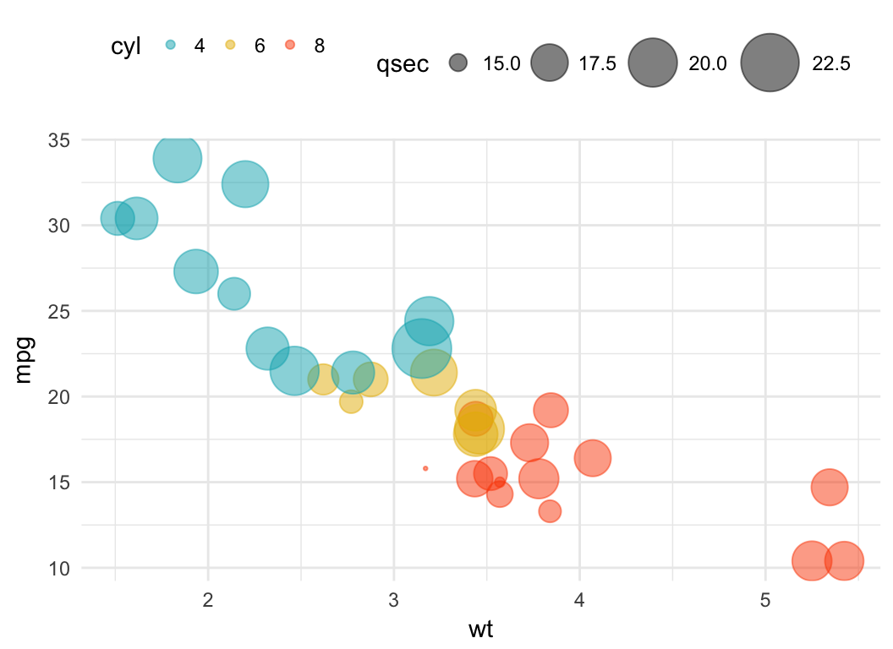

Learn statistics through short, focused tasks in R.
Each topic combines explanation, hands-on code, and a foldable solution, so you can check your work step by step.

<!-- Basics -->

  
  
Basic data exploration

  
Level 0 • essentials

  

    Mean, median, SD, missing values, frequency tables, and random simulation basics.
  

<!-- Correlation -->

  
  
Correlation

  
Level 1 • relationships between variables

  

    Compute Pearson/Spearman correlations, interpret results, and visualize relationships.
  

<!-- Regression -->

  
  
Linear Regression

  
Level 1 • prediction & interpretation

  

    Fit linear models, interpret coefficients, visualize predictions, and check model assumptions.
  

[//]: # (<!-- Group comparisons -->)

[//]: # (
)

[//]: # (  <a href="topics/ttest_anova.html">)

[//]: # (    )

[//]: # (  </a>)

[//]: # (  
Group Comparisons
)

[//]: # (  
Level 1 • t-tests & ANOVA
)

[//]: # (  
)

[//]: # (    Compare groups using t-tests and ANOVA, inspect effect sizes, and visualize differences.)

[//]: # (  
)

[//]: # (
)

<!-- Probability & simulation -->

  
  
Probability & Simulation

  
Level 1 • randomness & intuition

  

    Roll virtual dice, simulate events, estimate probabilities, and build intuition through code.
  

<!-- Machine learning & spam detection -->

  
  
Machine Learning & Spam Detection

  
Level 3 • classification & interpretation

  

    Detect spam using real text features. Learn how classification models work,
    how decision trees make predictions, and how to interpret model output responsibly.
  

<!-- ML: supervised -->

  
  
Spam Detection – Supervised Models

  
Level 3 • logistic regression & trees

  

    Train/test split, logistic regression, decision trees, confusion matrix, and interpretation.
  

<!-- ML: unsupervised (optional) -->

  
  
Spam Detection – Unsupervised (Optional)

  
Level 3 • clustering & structure

  

    Explore structure without labels: clustering and dimensionality reduction.
    Learn when unsupervised methods help — and when they don’t.
  

[//]: # (<!-- Power & sample size -->)

[//]: # (
)

[//]: # (  <a href="topics/power_sample_size.html">)

[//]: # (    )

[//]: # (  </a>)

[//]: # (  
Power & Sample Size
)

[//]: # (  
Level 1 • planning studies
)

[//]: # (  
)

[//]: # (    Understand statistical power, compute required sample sizes, and explore effect size scenarios.)

[//]: # (  
)

[//]: # (
)

